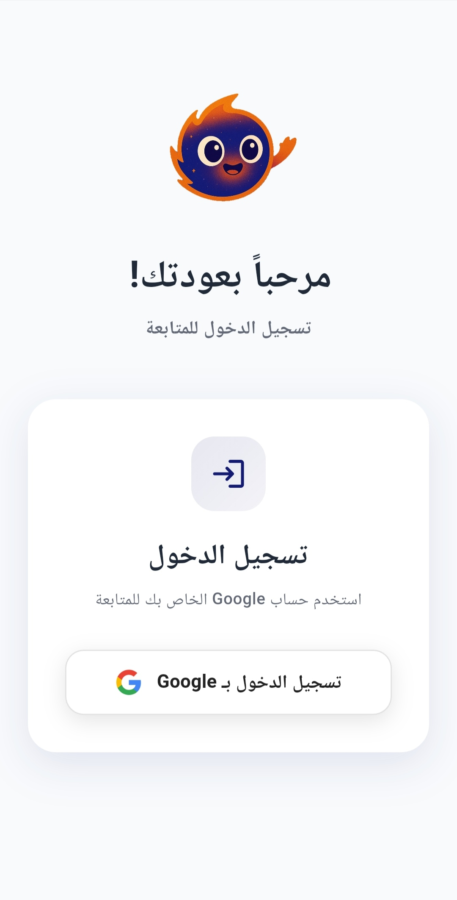

# 🧠 NovaEd
### Advanced Quiz & Learning Management System for High School Students

*Revolutionizing high school education through interactive quizzes and smart learning*

**🚀 Coming to Google Play - October 2024**

---

## 📋 Project Overview

NovaEd is an innovative quiz application designed specifically for high school students, combining engaging quiz mechanics with comprehensive learning management. Built with Flutter and powered by a robust .NET backend, this app transforms traditional studying into an interactive and enjoyable experience.

## ✨ Key Features

### 🎯 **Interactive Quiz System**
- **Smart Question Bank** - Comprehensive collection of high school curriculum questions
- **Adaptive Difficulty** - question selection based on student performance

### 📚 **Subject Management**
- **Curriculum Alignment** - Questions aligned with high school curricula
- **Topic Organization** - Structured content by subjects and difficulty levels
- **Study Materials** - Supplementary resources and explanations

### 📱 **User Experience**
- **Intuitive Design** - Clean, modern interface optimized for student engagement

## 🛠️ Technical Stack

| Component | Technology |
|-----------|------------|
| **Frontend** | Flutter & Dart |
| **Backend** | Integration with .NET |
| **State Management** | Cubit (BLoC Pattern) |
| **Architecture** | MVVM (Model-View-ViewModel) |
| **Version Control** | Git & GitHub |
| **Platform** | Google Play Store |

## 🏗️ Architecture

The app follows **MVVM (Model-View-ViewModel)** architecture pattern with **Cubit** for state management, ensuring:
- **Separation of Concerns** - Clean code organization and maintainability
- **Reactive Programming** - Efficient state management and UI updates
- **Scalability** - Easy feature additions and modifications
- **Testability** - Comprehensive unit and widget testing capabilities

> 

## 🎯 Development Status

- ✅ **UI Design** - Complete
- 🔄 **API Integration** - In Progress
- ⏳ **Testing** - Upcoming
- 📅 **Google Play Release** - October 2024

## 🚀 Upcoming Features

- **AI-Powered Study Recommendations** - Personalized learning paths
- **Video Explanations** - Visual learning support for complex topics
- **Parent Dashboard** - Progress monitoring for parents
- **Teacher Portal** - Educator tools for quiz creation and monitoring

## 📱 UI
> 
> 
> 
> 
> 
> 

## 🎥 Demo Video

  
  <!-- Direct Link as Backup -->
  <a href="https://www.linkedin.com/posts/activity-7336052241197338646-S3Xx?utm_source=share&utm_medium=member_android&rcm=ACoAAEZ080kBYve1e8OmVMu3Pfsw6lGiuHPfCuI">
    <strong>📱 Open in LinkedIn </strong>
  </a>
  

---

**🎓 Empowering the next generation through smart learning 🚀**

⭐ **Star this repository if you believe in the future of education!** ⭐

**📱 Available on Google Play - October 2024**

